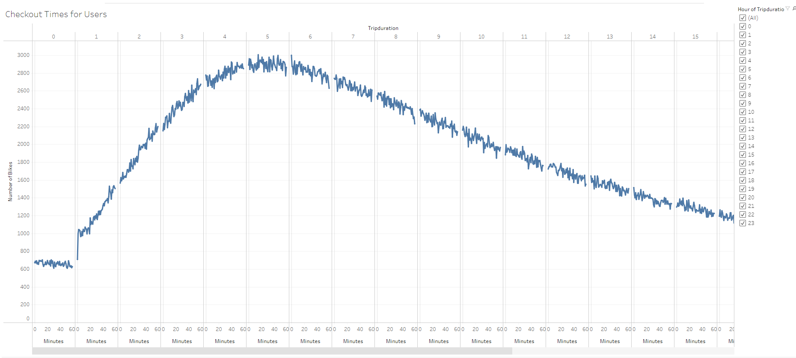
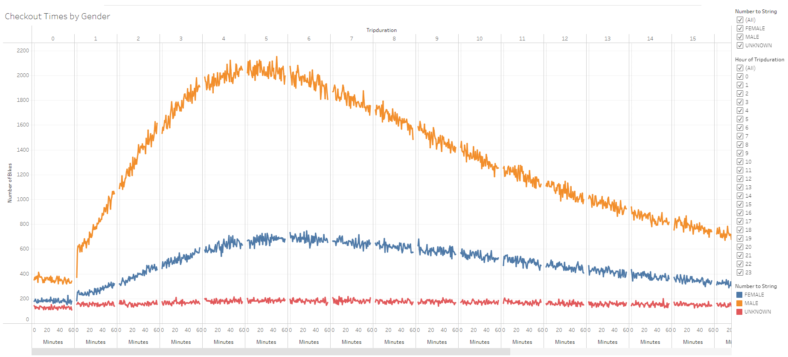
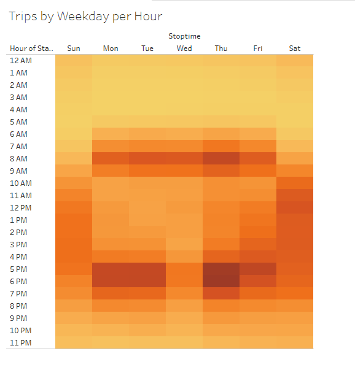
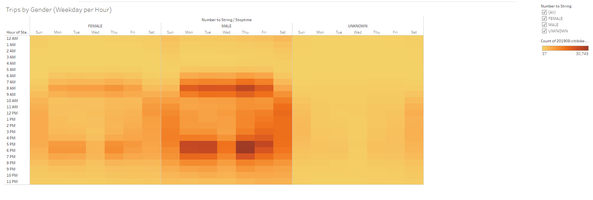
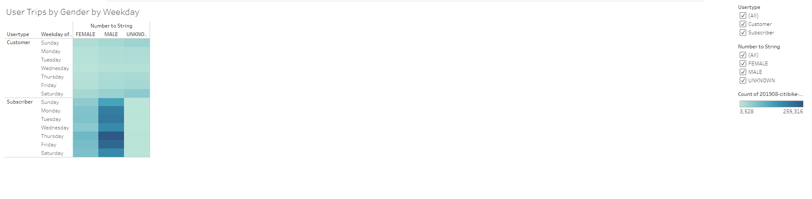

# An Analysis of Bike Sharing and its Expansion to Des Moines

## Overview
In this challenge, we dive a bit further into CitiBike data, creating visualization that help us better understand CitiBike usage and how it would translate to a new market. After converting the trip duration of rides to a more digestable minutes format, our visualization told a more compelling story of usage.

## Results
Please click the link below to view the visualization that I'll be explaining.

[Link to Tableau Dashboard](https://public.tableau.com/app/profile/andres.encinas)

After converting out data to datetime format to get minutes, I began further visualization.

First, we took a look at the trip duration of user trips, based off the start time. From this, we can see peak usage is met at the 5 hour mark. We also see that there is a rapid increase in usage from hours 1-4. There is a slow decline in usage from hour 5.

We then further filtered this data to show us usage by gender.We can begin to see that more males use citibike than other genders. The same findings from before apply here as well.

Here, we visualize usage per weekday, where yellow is less usage and red is more. We can see peak usage Mon-Wed to be 7am-9am and 5pm-7pm. We also see higher usage on Friday 12pm-8pm and Saturday/Sunday 10am-8pm, possibly due to people participating in activities over weekend hours.

This breaks down the last visualization by gender. Again, we can see that each gender follows similar usage trends, but there are significantly more male users.

Finally, we can see a breakdown of usage by weekday, filtered by gender and whether or not the user is a subscriber. We can see, again, a higher male usage. For non subscribers, Unknown gender makes up most usage, while for subscribers, it makes up the least.

